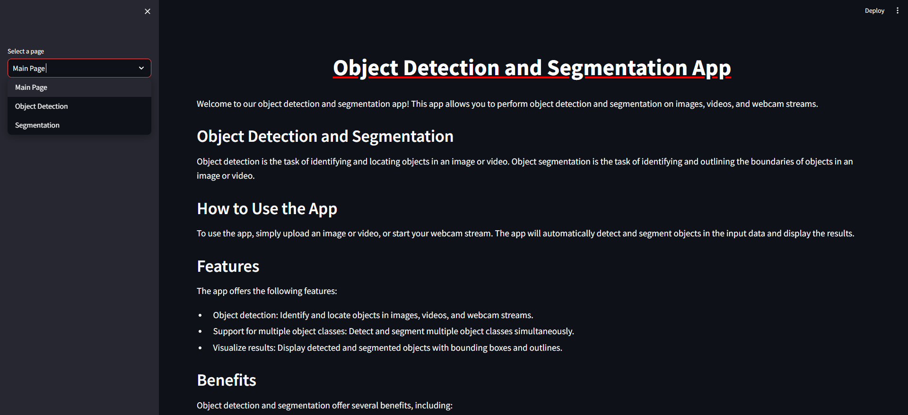

# Computer Vision Website 


## Description

On this website, created by streamlit, you can upload your image or video and the website will then detect or segment the objects you want.

## Table of Contents

- [Installation](#installation)
- [Usage](#usage)
- [Demo](#demo)
- [Author information](#author)
- [Contributing](#contributing)
- [License](#license)

## Installation

You can install these packages using pip:

```bash
pip install -r requirements.txt
```

## Usage

To utilize the animal detection model, follow these steps:

1. Clone this repository:
   ```bash
   git clone https://github.com/MertAkguel/CV_website.git
   ```

2. Launch the Streamlit website:

  ```bash
  streamlit run app.py
  ```

3. Follow the instructions on the Streamlit website to detect animals.

## Demo


 
4. Information about the author

## Author

**[Mert Akgül]** – *Computer Vision & AI Enthusiast*  
[Portfolio](https://medium.com/@Mert.A/list/projects-6f9bb92a3c21) | [Blog](https://medium.com/@Mert.A) | [LinkedIn](https://www.linkedin.com/in/mert-akgül)


   
